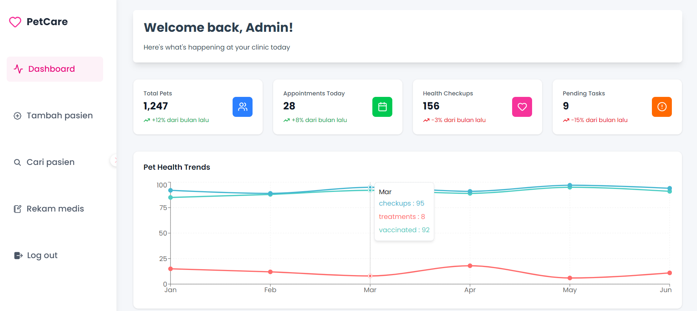

# Petshop Management System

A comprehensive web application for managing pet store operations built with modern web technologies.

## Demo Access

HEAD Live Demo: [https://petshop-kappa-khaki.vercel.app ](https://petshop-kappa-khaki.vercel.app)
=================================================================================================

### Features

- 🐕 **Pet Management** - Complete pet records and health tracking
- 📊 **Analytics Dashboard** - Business insights and reporting

## Tech Stack

- **Frontend:** React.js, Tailwind CSS, React Router
- **State Management:** Context API

## 📱 Screenshots



## Installation

```bash
# Clone repository
git clone https://github.com/yourusername/petshop-management

# Install dependencies
npm install

# Setup environment
cp .env.example .env

# Run development server
npm run dev
```
